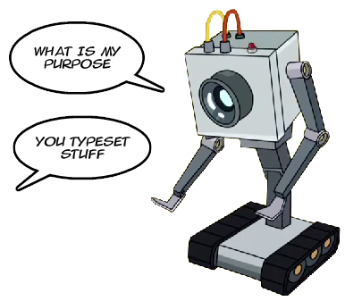

<p style="float:right">
    
</p>

<div style="float: left; width: calc(100% - 310px)">
<h1 >TypesetBot</h1>
    <p>Dynamically typeset text on the web.</p>

<p align="">
<a href="https://travis-ci.org/CoffeeIO/TypesetBot"></a>
<a href="https://www.codacy.com/app/mgapcdev/TypesetBot/dashboard"></a>
<br>
<a href="https://badge.fury.io/js/typesetbot"></a>
</p>

See [coffeeio.com](http://coffeeio.com/typesetbot) for complete docs and demos.
</div>
<div style="clear: both">


## Install

### CDN

TypesetBot
```html
<link href="https://unpkg.com/typesetbot/dist/typesetbot.min.css" rel="stylesheet">
<script src="https://unpkg.com/typesetbot/dist/typesetbot.min.js" type="text/javascript"></script>
```

Hyphenation Library

```html
<script src="https://unpkg.com/@coffeeio/hypher@1.0.0/dist/hypher.js" type="text/javascript"></script>
```

Hyphenation pattern, replace `{language-code}` with language code for example `en-us`. Full list can be found [here](https://github.com/fluid-project/hyphenation-patterns/tree/master/dist/browser).

```
https://unpkg.com/@fluid-project/hyphenation-patterns@0.2.2-dev.20181115T211247Z.d313a52/dist/browser/{language-code}.js
```

### Download

- [typesetbot.css](https://unpkg.com/typesetbot/dist/typesetbot.css)
- [typesetbot.js](https://unpkg.com/typesetbot/dist/typesetbot.js)
- [hypher.js](https://unpkg.com/@coffeeio/hypher@1.0.0/dist/hypher.js)
- Hyphenation pattern example: [en-us.js](https://unpkg.com/@fluid-project/hyphenation-patterns@0.2.2-dev.20181115T211247Z.d313a52/dist/browser/en-us.js)

Minified:
- [typesetbot.min.css](https://unpkg.com/typesetbot/dist/typesetbot.min.css)
- [typesetbot.min.js](https://unpkg.com/typesetbot/dist/typesetbot.min.js)


## License


### Commercial license

If you want to use TypesetBot to develop commercial sites, themes, projects, and applications, the Commercial license is the appropriate license. With this option, your source code is kept proprietary. Purchase a Flickity Commercial License at [coffeeio.com](http://coffeeio.com/)

### Open source license

If you are creating an open source application under a license compatible with the [GNU GPL license v3](https://www.gnu.org/licenses/gpl-3.0.html), you may use TypesetBot under the terms of the GPLv3.


## Usage


More examples found at [coffeeio.com](http://coffeeio.com/typesetbot/examples)

```html
<head>
<link rel="stylesheet" href="https://unpkg.com/typesetbot/dist/typesetbot.min.css">
<script type="text/javascript" src="https://unpkg.com/typesetbot/dist/typesetbot.min.js"></script>

<!-- (optional) -->
<!-- hyphenation library -->
<script type="text/javascript" src="https://unpkg.com/@coffeeio/hypher@1.0.0/dist/hypher.js"></script>
<!-- hyphenation pattern for US english -->
<script type="text/javascript" src="https://unpkg.com/@fluid-project/hyphenation-patterns@0.2.2-dev.20181115T211247Z.d313a52/dist/browser/en-us.js"></script>

<!-- Initialize TypesetBot -->
<script type="text/javascript">
    let tsb = new TypesetBot(
        '.container', // Query selector.
        {
            'hyphenLanguage': 'en-us',
            'alignment': 'justify'
        }
    );
</script>
</head>

<body>
    <p class="container">Lorem ipsum...</p>
    <p class="container">Lorem ipsum...</p>
</body>
```

## Settings


Default settings. Any setting can be overwritten.
Most common settings to adjust is `hyphenLanguage` and `alignment`.

```js
{
    // Hyphenation. -----------------------------------------------------------

    // Language of hyphenation patterns to use
    hyphenLanguage: string = 'en-us';

    // Minimum number of letters to keep on the left side of word
    hyphenLeftMin : number = 2;

    // Minimum number of letters to keep on the right side of word
    hyphenRightMin: number = 2;

    // Algorithm. -------------------------------------------------------------

    // Other options are 'left', 'right' and 'center'.
    alignment: string = 'justify';

    // Penalty for line-breaking on a hyphen
    hyphenPenalty      : number = 50;

    // Penalty for line-breaking on a hyphen when using ragged text
    hyphenPenaltyRagged: number = 500;

    // Penalty when current and last line had flag value 1.
    flagPenalty        : number = 3000;

    // Penalty when switching between ratio classes.
    fitnessClassDemerit: number = 3000;

    // 4 classes of adjustment ratios.
    fitnessClasses: number[] = [-1, -0.5, 0.5, 1, Infinity];

    // Offset to prefer fewer lines by increasing demerit of "~zero badness lines"
    demeritOffset      : number = 1;

    // Max adjustment ratio before we give up on finding solutions
    absoluteMaxRatio: number = 5;

    // Maximum acceptable adjustment ratio.
    maxRatio: number = 2;
    // Minimum acceptable adjustment ratio. Less than -1 will make the text too closely spaced.
    minRatio: number = -1;

    // Tags inside element that might break the typesetting algorithm
    unsupportedTags: string[] = ['BR', 'IMG'];

    // Font. ------------------------------------------------------------------

    // Ideal space width
    spaceWidth         : number = 1 / 3;

    // How much can the space width stretch
    spaceStretchability: number = 1 / 6;

    // How much can the space width shrink
    spaceShrinkability : number = 1 / 9;

    // Debug mode. ------------------------------------------------------------

    // Prints performance stats.
    debug: boolean = false;

    // Don't run Typesetting as soon as program is initialized.
    noRun: boolean = false;

    // Define levels to log. Options: 'error', 'warn', 'log'
    logs: string[] = ['error', 'warn'];
}
```

See [coffeeio.com](http://coffeeio.com/typesetbot) for complete docs and demos.

---

Copyright &copy; 2020 CoffeeIO (Mathias Grundtvig Andreasen).

</div>
